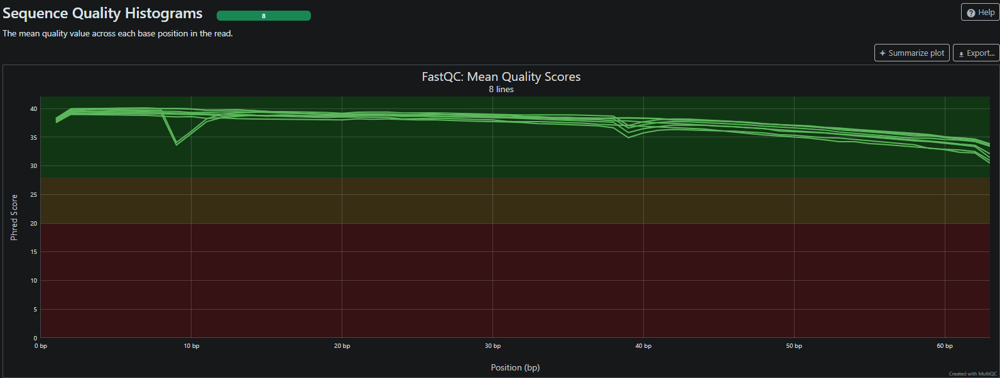

[Back to Home](../README.md)
## 2. Quality check (QC)


> We have to check the fastq files quailty before proceeding!

List the first 4 lines of one fastq file:
```fastq
@SRR1039508.1 HWI-ST177:290:C0TECACXX:1:1101:1225:2130 length=63
CATTGCTGATACCAANNNNNNNNGCATTCCTCAAGGTCTTCCTCCTTCCCTTACGGAATTACA
+SRR1039508.1 HWI-ST177:290:C0TECACXX:1:1101:1225:2130 length=63
HJJJJJJJJJJJJJJ########00?GHIJJJJJJJIJJJJJJJJJJJJJJJJJHHHFFFFFD
```
Line meanings:
1. Read information line, always starts with a ```@```
2. The DNA sequence
3. Read info, sometimes same as line 1., always starts with ```+```
4. String of characters, representing quality score for each nucleotide (Phred-score)

<details><summary>Solution</summary>

```bash
head -n 4 SRR1039508.1.fastq
```

</details>

### Phred-score system
The line 4 has characters encoding the quality of each nucleotide in the read. The legend below provides the mapping of quality scores (Phred = ASCII - 33) to the quality encoding characters. *Different quality encoding scales exist (differing by offset in the ASCII table), but note the most commonly used one is fastqsanger, which is the scale output by Illumina since mid-2011.*

```
 Quality encoding: !"#$%&'()*+,-./0123456789:;<=>?@ABCDEFGHI
                   |         |         |         |         |
    Quality score: 0........10........20........30........40 
```

Each quality score represents the probability that the corresponding nucleotide call is incorrect. This quality score is logarithmically based and is calculated as:

```
Q = -10 x log10(Perror), where P is the probability that a base call is erroneous
```
> e.g. First nucleotide in SRR1039508.1 is Cytosine with ASCII character 'H'. ASCII(H) = 72, Phred-score = 72-33 = 39

Q = -10 x log10(Perror) --> Perror = 10^-(39/10) --> 0.0126% chance that the nucleotide base is worng.

----------------
### FastQC tool
**FastQC is used to check the per-base quality of FASTQ files.**

**Start interactive shell:**
```bash
salloc --pty --nodes=1 --ntasks=1 --mem=8G --time=01:00:00 bash
```

**Load necessary tools:**
```bash
ml fastqc
```

**Run quality check for all files:**
```bash
fastqc $SCRATCH/*.fastq -o ./
```

> We can reduce the analysis times using multiple threads!
-----------------
**Start a new interactive shell with more threads:**
```bash
exit #close current session

srun --pty --nodes=1 --ntasks=1 --mem=8G --cpus-per-task=4 --time=01:00:00 bash
```

Use the ```--help``` option to see how to set multiple threads for FastQC! (set 4 threads)


<details><summary>Solution</summary>

```bash
fastqc -t 4 $SCRATCH/raw_data/*.fastq.gz -o ./
```
>Now 4 files are processed paralelly at once!
</details>


----------------
**Collect and combine files with MultiQC easily:**
```
multiqc ./
```

**Examine output:**


-------------

|Previous|Home|Next|
|--------|----|----|
|[Data Access](../01_data/data_access.md)|[Home](../README.md)|[Trimming](../03_trimming/trimming.md)