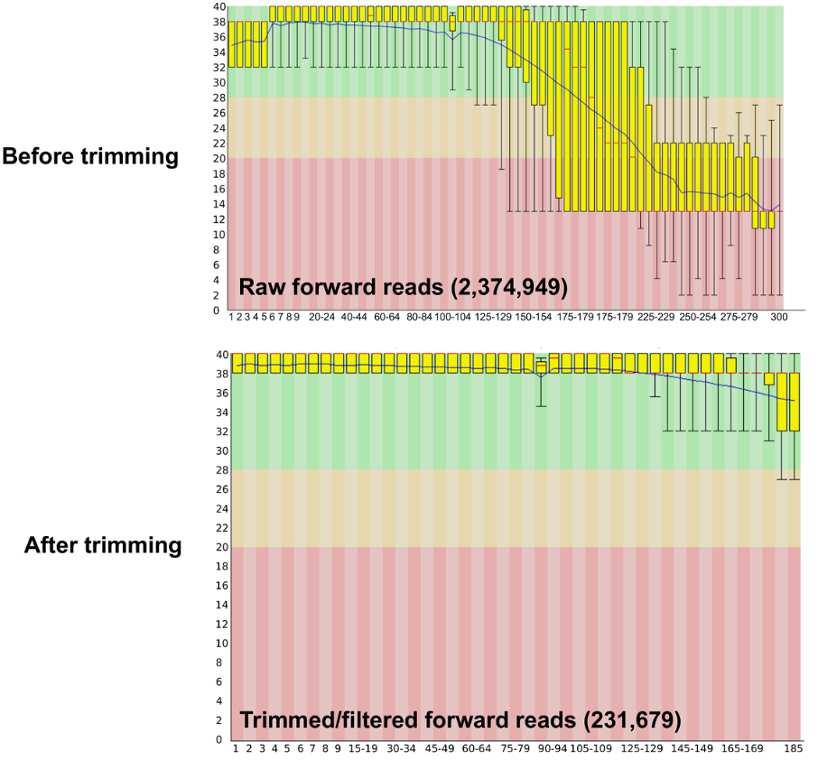
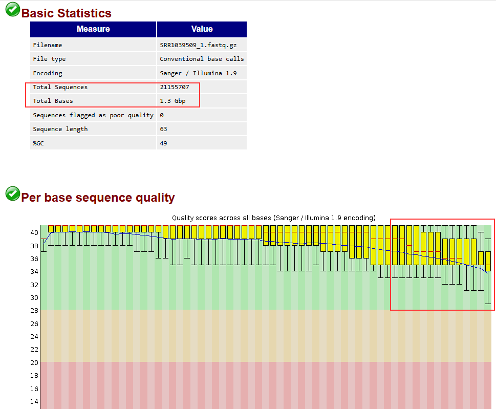
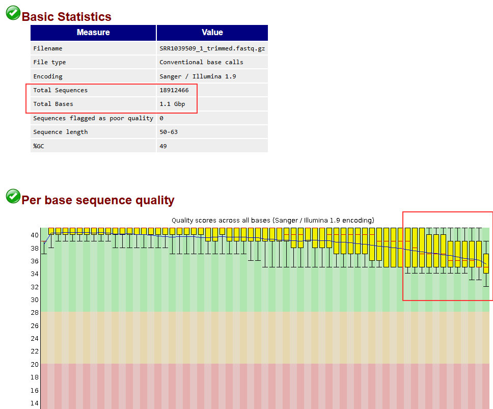

[Back to Home](../README.md)
### 3. Trimming

----------------

### Iterating through the fatsq files and doing the trimming
Trimming is the process of removing low quality read sequences due to missed detections based on Q-value scores in FASTQ files. It is an optional step after QC, to move further with only good quality data.

### **Example:**



----------------
> *Luckily our data is high quality FASTQ files from Illumina Hiseq instruments with overall Q-score > 30 in all positions for all files (see MultiQC outputs).*

To perform trimming, we use ```Trimmomatic```, allowing many options to trim and modify our FASTQ files.

Perform the trimming of the file ```SRR1039509``` based on the following general scheme of Trimmomatic. (See ```--help``` or the [User manual](http://www.usadellab.org/cms/uploads/supplementary/Trimmomatic/TrimmomaticManual_V0.32.pdf) for further information)

```bash
salloc --nodes=1 --ntasks=1 --mem=16G --cpus-per-task=16 --time=10:00:00
```

```bash
ml trimmomatic
```

**Make an output folder for the trimmed files:**
```bash
mkdir ./workshop_results/trimmed_data
```

**Change the following parameters to start trimming:**
```bash
trimmomatic PE -threads <number_of_threads> \
  <forward_reads_input> <reverse_reads_input> \
  <forward_reads_paired_output> <forward_reads_unpaired_output> \
  <reverse_reads_paired_output> <reverse_reads_unpaired_output> \
  ILLUMINACLIP:<adapter_file>:<seed_mismatches>:<palindrome_clip>:<simple_clip> \
  SLIDINGWINDOW:<window_size>:<required_quality> \
  LEADING:<leading_quality> \
  TRAILING:<trailing_quality> \
  MINLEN:<minimum_length>
```

<details><summary>Solution</summary>

```bash
trimmomatic PE -threads 16 \
  /common/workshop_data/raw_gzip/SRR1039509_1.fastq.gz /common/workshop_data/raw_gzip/SRR1039509_2.fastq.gz \
  ./workshop_results/trimmed_data/SRR1039509_1.trimmed.fastq.gz \
  ./workshop_results/trimmed_data/SRR1039509_1.unpaired.fastq.gz \
  ./workshop_results/trimmed_data/SRR1039509_2.trimmed.fastq.gz \
  ./workshop_results/trimmed_data/SRR1039509_2.unpaired.fastq.gz \
  ILLUMINACLIP:/common/workshop_data/other/TruSeq3-PE.fa:2:30:10 \
  SLIDINGWINDOW:4:20 \
  LEADING:3 \
  TRAILING:3 \
  MINLEN:50
```
</details>

**Perform GC again and compare the files before and after trimming!**

```bash
mkdir ./workshop_results/trimmed_qc
fastqc -t 4 ./workshop_results/trimmed_data/*.fastq.gz -o ./workshop_results/trimmed_qc
```

-------------------
### Before trimming FASTQC output


------------

### After trimming FASTQC output


<details><summary>Expected output</summary>

```bash
Using PrefixPair: 'TACACTCTTTCCCTACACGACGCTCTTCCGATCT' and 'GTGACTGGAGTTCAGACGTGTGCTCTTCCGATCT'
ILLUMINACLIP: Using 1 prefix pairs, 0 forward/reverse sequences, 0 forward only sequences, 0 reverse only sequences
Quality encoding detected as phred33
Input Read Pairs: 21155707 Both Surviving: 18912466 (89.40%) Forward Only Surviving: 1218056 (5.76%) Reverse Only Surviving: 584666 (2.76%) Dropped: 440519 (2.08%)
TrimmomaticPE: Completed successfully
```

</details>

**Exercise:**

Some questions to think about:
1. What happens if MINLEN:10? What if MINLEN:100?
2. SLIDINGWINDOWS vs TRAILING, what is the difference?
3. Does Trimmomatic provide other adapter files for different sequencing platforms?

<details><summary>Answers</summary>

1. MINLEN:10 would keep very short reads, which may not be useful for alignment and could increase noise. MINLEN:100 would discard all reads, which is also not very useful.

2. SLIDINGWINDOW:4:20 scans a window of 4 bases and requires an average quality of 20 to keep the read, while TRAILING:3 removes bases from the end of the read if they fall below a quality of 3.

3. `find /opt -name TruSeq3-PE.fa`

</details>

-------------
|Previous|Home|Next|
|--------|----|----|
|[Quality Control](../02_QC/quality_control.md)|[Home](../README.md)|[Alignment](../04_alignment/alignment.md)|
