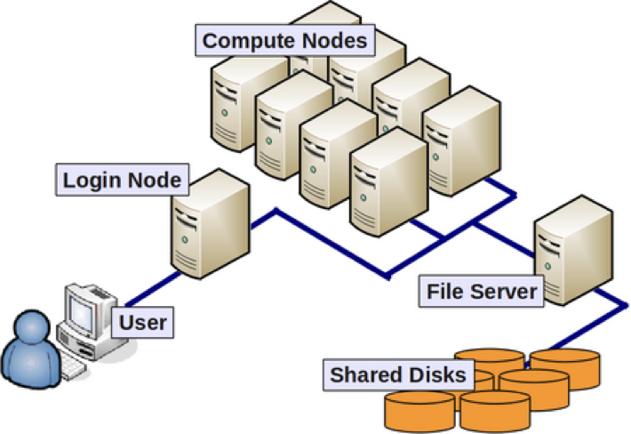

[Back to Home](../README.md)

## SLURM: Job Scheduling on HPC

This section covers SLURM (Simple Linux Utility for Resource Management), the workload manager used on many high-performance computing clusters.

SLURM allows users to:
- Request computational resources
- Submit batch jobs
- Run interactive sessions
- Monitor job status
- Manage parallel workloads efficiently

Instead of running heavy computations on login nodes, SLURM schedules jobs on compute nodes, ensuring fair resource usage and system stability.

Typical workflow:
- Request resources (salloc or sbatch)
- Load required modules
- Run analysis
- Collect outputs
- Exit session

Understanding SLURM is essential for reproducible and scalable bioinformatics analyses on HPC systems.

[Working in an HPC environment](https://hbctraining.github.io/Intro-to-bulk-RNAseq/lessons/03_working_on_HPC.html) (*External link*)

## HPC cluster overview



*Image source: HBCTraining*

### Check the nodes
```
sinfo
sinfo -l                                    # more details
sinfo --format=%all | awk '{print $1}'      # even more details
sinfo --format=%all                         # all the details  
```

- What nodes exist?
- Maximum runtime?
- How many cores?
- Which partitions?

### Some useful Slurm commands

**See running job**
```bash
squeue
squeue -u {YOUR_USERNAME}
sq
```

**Cancel the job!**
```bash
scancel [jobid]
sq                  # should be empty
```

**Inspect a job**
```bash
scontrol show job [jobid]
```

**See past jobs**
```bash
sacct -u {YOUR_USERNAME}
sac                         # more informative
```

## Test run

```
srun hostname
```
What does the printed value show?
Did the hostname match the login node?

## 0. Tumor simulation

```
cp -r /common/bioinformatics-hpc/08_Slurm/cancer_job ~/
cd ~/cancer_job
sbatch tumor_simulation.sbatch
bash monitor.sh
```

## 1. Data download

**Submit your first job!**
```bash
cd
mkdir ./sbatch_scripts
mkdir ./logs
cp /common/bioinformatics-hpc/08_Slurm/*.sbatch ./sbatch_scripts/
sbatch ./sbatch_scripts/data_download.sbatch
```

## 2. FastQC

**Modify and run the quality control for all fastq files!**

```
sbatch qc.sbatch
```

**Open the output and error files**
- What is the output showing? 
- Were there any error messages during the run? Check `.err` file.

## 3. Trimming

In this step, we will transition from running a single command to using Job Arrays. This allows us to submit one script that Slurm will automatically replicate for each of our 4 samples, assigning each a unique ```${SLURM_ARRAY_TASK_ID}```.

**Modify the ```trimming.sbatch``` file to process all samples as separate sub-jobs!**
1. Open the file ```nano trimming.sbatch```
2. The SBATCH header ```#SBATCH --array=0-3``` tells SLURM to launch 4 jobs
3. Define the list of Samples
4.  ```SAMPLE=${SAMPLES[$SLURM_ARRAY_TASK_ID]}``` distributes jobs for the 4 samples
5. Update trimmomatic ```input``` and ```output``` folder paths.
6. Save and exit the file, then submit with ```sbatch trimming.sbatch```.

## 4. Alignment

For STAR alignment, instead of running a single SLURM job that loops through all FASTQ files sequentially (which is slow and inefficient), we can use SLURM job arrays. Job arrays allow us to process multiple FASTQ files in parallel, significantly speeding up the alignment step and making better use of cluster resources.

0. Make a new directory for STAR outputs.
1. Locate the file ```star_alignment.sbatch```.
2. Print the content of the file.
3. Open the script with a file editor:
    - Change the desired parameters:
        - SBATCH ```--job-name```
        - ```/PATH/TO/STAR_IINDEX```
        - ```/PATH/TO/READS```
        - ```/PATH/TO/OUTPUT```
    - Convert the script to a **job array**
        - Add a ```#SBATCH --array=``` line
        - Remove the for loop
        - Use ```$SLURM_ARRAY_TASK_ID``` to select one sample
4. Submit the job with ```sbatch star_alignment.sbatch```

## 5. Counting

This SLURM job submits featureCounts to the cluster to quantify reads per gene from all STAR-aligned BAM files in parallel.
Before running, make sure to update the SBATCH job name, the GTF path, and the STAR output path, then submit with ```sbatch counting.sbatch```.

## 6. DEA

In this step, we submit a SLURM job to run the limma differential expression analysis on the count matrix generated by featureCounts as before.
Before submitting, update the job name and the path to your count file, then run ```sbatch limma_analysis.sbatch``` and monitor the job with ```squeue -u $USER```.

## Final questions

What are the advantages of using SLURM for job scheduling on HPC clusters?
<details><summary>Answer</summary>

- Efficient resource management: SLURM allocates resources based on job requirements, optimizing cluster usage.

- Scalability: SLURM can handle a large number of jobs and users, making it suitable for large HPC environments.

- Flexibility: SLURM supports various job types (batch, interactive, parallel) and allows users to specify resource needs (CPU, memory, time).

- Job monitoring and control: SLURM provides tools to monitor job status, view logs, and cancel jobs if needed.
</details>
</br>

---


Why might your job stay in PD state even if nodes appear idle?
<details><summary>Answer</summary>

- Resource constraints: Your job may be waiting for specific resources (e.g., memory, CPUs) that are currently unavailable, even if nodes are idle.

- Job priority: Other jobs with higher priority may be scheduled before yours, causing it to remain in PD state.

- Scheduling policies: The cluster's scheduling policies may affect job placement, leading to delays in job start time.
</details>
</br>

---


What happens if everyone requests 128 GB memory "just to be safe"?
<details><summary>Answer</summary>

- Resource contention: If many users request excessive memory, it can lead to resource contention, causing jobs to be delayed or fail due to insufficient resources.

- Inefficient scheduling: The scheduler may struggle to find suitable nodes for jobs, leading to longer wait times and reduced overall cluster efficiency.

- Wasted resources: Requesting more memory than needed can lead to underutilization of cluster resources, as nodes may be allocated but not fully utilized, impacting other users' ability to run their jobs.
</details>
</br>

---


What is the difference between AllocTRES and ReqTRES?
<details><summary>Answer</summary>

- AllocTRES (Allocated Trackable RESources): This represents the resources that have been allocated to a job by the scheduler. It indicates the actual resources assigned to the job for execution.

- ReqTRES (Requested Trackable RESources): This represents the resources that a user has requested for their job. It indicates the resources that the user has specified as needed for their job to run, but it may not reflect the actual resources allocated by the scheduler, which can be less than or equal to the requested resources based on availability and scheduling policies.
</details>
</br>

---

Why should you never run STAR on the login node?
<details><summary>Answer</summary>

- Running STAR on the login node can lead to resource contention and negatively impact other users' ability to access the cluster.

- The login node is not designed for compute-intensive tasks and may not have the necessary resources (CPU, memory) to run STAR efficiently.

- It is best practice to submit jobs to the compute nodes via SLURM to ensure fair resource allocation and optimal performance.
</details>
</br>

---

How would you check how many CPUs were allocated?
<details><summary>Answer</summary>
You can check how many CPUs were allocated to your job by using the `scontrol show job <job_id>` command, where `<job_id>` is the ID of your job. Look for the `NumCPUs` field in the output. Also running `echo $SLURM_CPUS_PER_TASK` inside your batch script.
</details>
</br>

---

Does --array=0-3 guarantee 4 parallel executions?
<details><summary>Answer</summary>
No. It submits 4 jobs, but concurrency depends on available resources.
</details>
