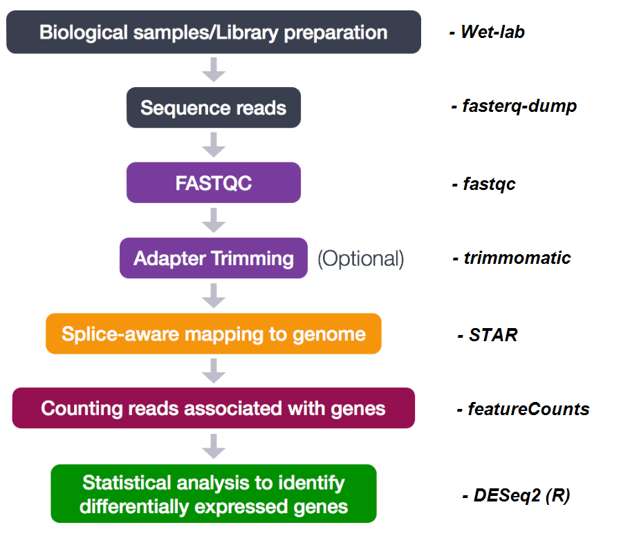

# Cutting-Edge Bioinformatics in a High-Performance Computing Environment
***HCEMM** - Scientific Computing ACF*  
Instructors: Joao Sequeira, Maria Kavoosi, Istvan Szepesi-Nagy

---

## Course Introduction
This course introduces advanced bioinformatics techniques within high-performance computing (HPC) environments. Participants will learn to efficiently manage computational workflows, leverage HPC resources, and apply bioinformatics tools to analyze biological datasets. By the end of the course, students will gain hands-on experience in combining computational power with cutting-edge bioinformatics approaches.

---

## General bioinformatics pipeline

*Source: HBCTraining - Introduction to RNA-Seq using high-performance computing*

## Content
1. [Data download](./01_data/data_access.md) (*fasterq-dump*)
2. [Quality Control](./02_QC/quality_control.md) (*fastqc*)
3. [Trimming](./03_trimming/trimming.md) (*trimmomatic*)
4. [Alignment](./04_alignment/alignment.md) (*STAR*)
5. [Counting](./05_counting/counting.md) (*featureCounts*)
6. [Pseudo-alignment](./06_salmon/pseudo_aligner.md) (*Salmon*)
7. [Differential expression analysis](./07_DE/diff_expression.md) (*limma* in R)
8. [SLURM](./SLURM/SLURM.md) (*Task submissions on HPC systems*)
--------------
<details><summary><strong>Conda Enviroment Setup</strong></summary>

### Enviroment setup
Load Miniconda:
```bash
module load miniconda3
OR
ml miniconda3
```
Check:
```bash
conda --version
    conda 25.11.1
```

Create our environment:
```bash
conda create -f bioinfo-hpc.yml
```

Activate environment:
```bash
conda activate bioinfo-hpc
```

<details><summary>Problems</summary>

If conda environment is not activated, try:
```bash
/opt/miniconda3/bin/conda init bash
source ~/.bashrc
```
then try activating the environment again!

</details>
</details>


## References
- Course content is based on HBCTraining website (Harvard Chan Bioinformatics Core) - doi.org/10.5281/zenodo.5833880
- Differential expression analysis pipelines are influenced by Marta Perez Alcantra's content on [bulk RNA-seq analysis](https://mperalc.gitlab.io/bulk_RNA-seq_workshop_2021/index.html).
- Publicly available data is accessed through the Seqeunce Read Archive (SRA) based on [Himes *et al.*, 2014.](https://pubmed.ncbi.nlm.nih.gov/24926665/) - ([SRP033351](https://www.ncbi.nlm.nih.gov/Traces/study/?acc=PRJNA229998&o=acc_s%3Aa))


